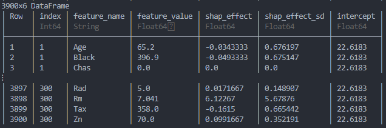

[](https://travis-ci.org/nredell/ShapML.jl)
[](https://codecov.io/gh/nredell/ShapML.jl)
[](https://nredell.github.io/ShapML.jl/dev)

# ShapML 

The purpose of `ShapML` is to compute stochastic feature-level Shapley values which
can be used to (a) interpret and/or (b) assess the fairness of any machine learning model.
**[Shapley values](https://christophm.github.io/interpretable-ml-book/shapley.html)**
are an intuitive and theoretically sound model-agnostic diagnostic tool to understand both **global feature importance** across all instances in a data set and instance/row-level **local feature importance** in black-box machine learning models.

This package implements the algorithm described in
[Štrumbelj and Kononenko's (2014) sampling-based Shapley approximation algorithm](https://link.springer.com/article/10.1007%2Fs10115-013-0679-x)
to compute the stochastic Shapley values for a given instance and model feature.

* **Flexibility**:
    + Shapley values can be estimated for any machine learning model using a simple user-defined `predict()` wrapper function.

* **Speed**:
    + The speed advantage of `ShapML` comes in the form of giving the user the ability to select 1 or more target features of interest and avoid having to compute Shapley values for all model features (i.e., a subset of target features from a trained model will return the same feature-level Shapley values as the full model with all features). This is especially useful in high-dimensional models as the computation of a Shapley value is exponential in the number of features.


## Install

``` julia
using Pkg
Pkg.add("ShapML")
```


## Documentation and Vignettes

* [Docs](https://nredell.github.io/ShapML.jl/dev/)


## Example

``` julia
using ShapML
using Random
using RDatasets
using DataFrames
using MLJ

# Load data.
boston = RDatasets.dataset("MASS", "Boston")
#------------------------------------------------------------------------------
# Train a machine learning model; currently limited to single outcome regression and binary classification.
outcome_name = "MedV"

# Data prep.
y, X = MLJ.unpack(boston, ==(Symbol(outcome_name)), colname -> true)

# Instantiate an ML model; choose any single-outcome ML model from any package.
random_forest = @load RandomForestRegressor pkg = "DecisionTree"
model = MLJ.machine(random_forest, X, y)

# Train the model.
fit!(model)

# Create a wrapper function that takes the following positional arguments: (1) a
# trained ML model from any Julia package, (2) a DataFrame of model features. The
# function should return a 1-column DataFrame of predictions--column names do not matter.
function predict_function(model, data)
  data_pred = DataFrame(y_pred = predict(model, data))
  return data_pred
end
#------------------------------------------------------------------------------
# ShapML setup.
explain = copy(boston[1:300, :]) # Compute Shapley feature-level predictions for 300 instances.
explain = select(explain, Not(Symbol(outcome_name)))  # Remove the outcome column.

reference = copy(boston)  # An optional reference population to compute the baseline prediction.
reference = select(reference, Not(Symbol(outcome_name)))

sample_size = 60  # Number of Monte Carlo samples.
#------------------------------------------------------------------------------
# Compute stochastic Shapley values.
Random.seed!(224)
data_shap = ShapML.shap(explain = explain,
                        reference = reference,
                        model = model,
                        predict_function = predict_function,
                        sample_size = sample_size
                        )

show(data_shap, allcols = true)
```
<p align="center">
    
</p>

* Now we'll create several plots that summarize the Shapley results for our Random Forest model.
These plots will eventually be refined and incorporated into `ShapML`.

* **Global feature importance**
    + Because Shapley values represent deviations from the average or baseline prediction,
    plotting their average absolute value for each feature gives a sense of the magnitude with which
    they affect model predictions across all explained instances.

``` julia
data_plot = DataFrames.by(data_shap, [:feature_name],
                          mean_effect = [:shap_effect] => x -> mean(abs.(x.shap_effect)))

data_plot = sort(data_plot, order(:mean_effect, rev = true))

baseline = round(data_shap.intercept[1], digits = 1)

p = plot(data_plot, y = :feature_name, x = :mean_effect, Coord.cartesian(yflip = true),
         Scale.y_discrete, Geom.bar(position = :dodge, orientation = :horizontal),
         Theme(bar_spacing = 1mm),
         Guide.xlabel("|Shapley effect| (baseline = $baseline)"), Guide.ylabel(nothing),
         Guide.title("Feature Importance - Mean Absolute Shapley Value"))
p
```
<p align="center">
    
</p>


* **Global feature effects**
    + The plot below shows how changing the value of the `Rm` feature--the most influential feature overall--affects
    model predictions (holding the other features constant). Each point represents 1 of our 300 explained instances.
    The black line is a loess line of best fit to summarize the effect.

``` julia
data_plot = data_shap[data_shap.feature_name .== "Rm", :]  # Selecting 1 feature for ease of plotting.

baseline = round(data_shap.intercept[1], digits = 1)

p_points = layer(data_plot, x = :feature_value, y = :shap_effect, Geom.point())
p_line = layer(data_plot, x = :feature_value, y = :shap_effect, Geom.smooth(method = :loess, smoothing = 0.5),
               style(line_width = 0.75mm,), Theme(default_color = "black"))
p = plot(p_line, p_points, Guide.xlabel("Feature value"), Guide.ylabel("Shapley effect (baseline = $baseline)"),
         Guide.title("Feature Effect - $(data_plot.feature_name[1])"))
p
```
<p align="center">
    
</p>
